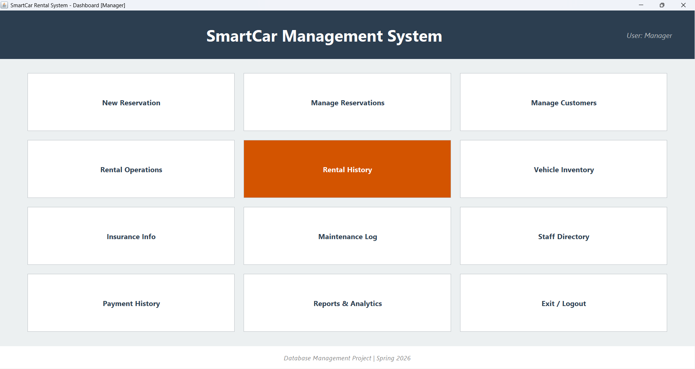
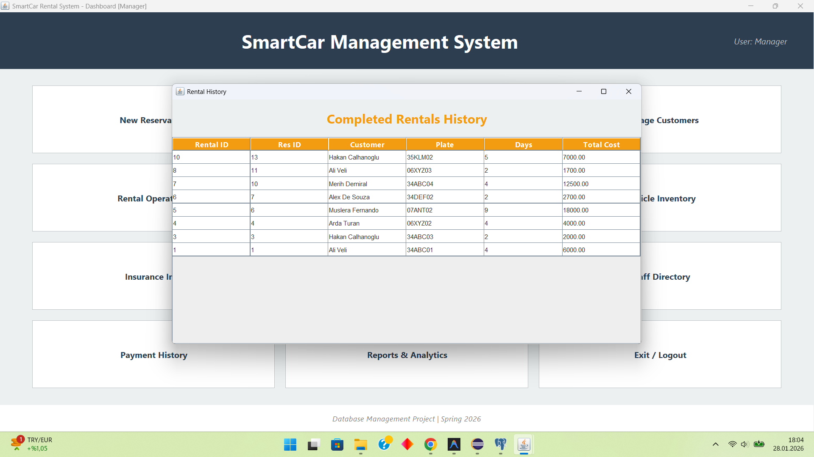
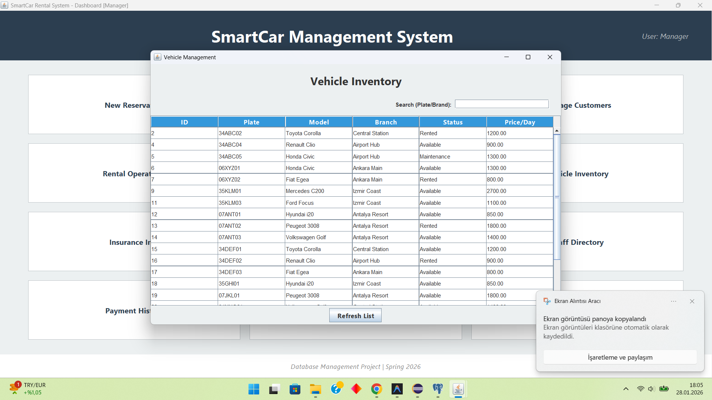
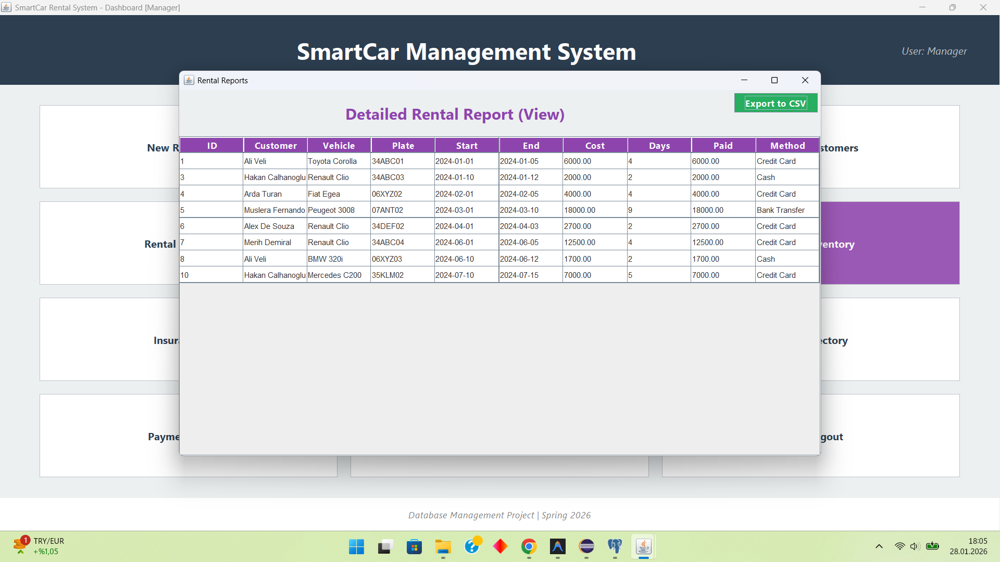
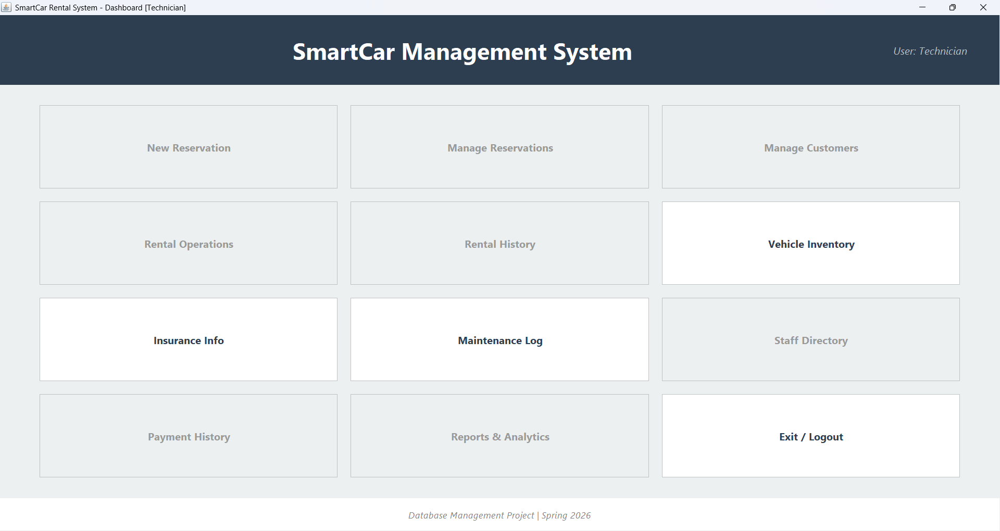
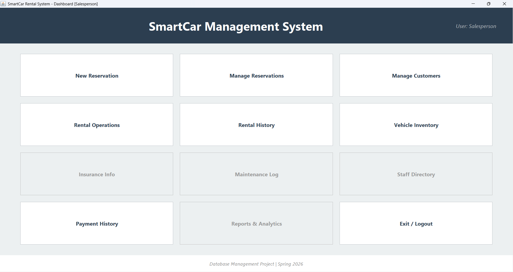

# SmartCar Rental Management System 🚗

A comprehensive desktop application for managing a car rental business, built with **Java Swing** and **PostgreSQL**. This project demonstrates advanced database concepts including Stored Procedures, Triggers, Views, and Transaction Management in a real-world scenario.

## 🌟 Features

### Core Modules
- **Reservation Management:** Create, update, cancel, and view reservations.
- **Fleet Management:** Track vehicle status (Available, Rented, Maintenance) and inventory.
- **Customer Management:** Full CRUD operations for customer records.
- **Master-Detail Views:** Browse branches and their associated employees.
- **Reporting:** Detailed rental history and financial reports with **CSV Export**.

### Advanced Highlights
- **Role-Based Access Control:** Login simulation for Manager, Salesperson, and Technician roles.
- **Live Search:** Instant filtering for vehicles and customers.
- **Database Integrity:** 
  - **Triggers:** Automatically prevent renting vehicles currently under maintenance.
  - **Transactions:** Ensuring atomic updates when cancelling reservations (freeing up vehicle + updating status).
  - **Stored Procedures:** Handling complex reservation logic on the database side.

## 🛠️ Technologies Used
- **Language:** Java (Swing/AWT)
- **Database:** PostgreSQL
- **Architecture:** DAO (Data Access Object) Pattern
- **Tools:** JDBC, IntelliJ IDEA / VS Code

## 🚀 How to Run

1. **Database Setup:**
   - Install PostgreSQL.
   - Run the SQL scripts in the `database/` folder in this order:
     1. [schema.sql](cci:7://file:///c:/Users/Serha/OneDrive/Desktop/Database%20proje/database/schema.sql:0:0-0:0) (Creates tables and relationships)
     2. `programmability.sql` (Adds procedures, views, triggers)
     3. `seed.sql` (Populates dummy data)

2. **Application Configuration:**
   - Open `src/db/DatabaseConnection.java`.
   - Update the `username` and `password` with your local PostgreSQL credentials.

3. **Launch:**
   - Compile and run [src/Main.java].

## 📸 Screenshots

> **Note:** This repository contains the **Desktop Application** (Admin Panel). For the customer-facing Web Interface, please visit: [Link-to-Web-Repo-Here]

## 📄 License
This project is open-source and available under the MIT License.

*This project was developed using Google's Antigravity plugin.*